> This page is incomplete and everything in this page is subject to change.
{.is-warning}

> This page explains advanced features, some players may not understand everything in this page.
{.is-warning}

# <i class="fa-duotone fa-inbox-in"></i> Input
These are blocks that are used to power wiring systems. They do not receive wiring inputs, and can only output.
## {.tabset}
### Block Touch Detector
Emits a signal when touched by an unachored block or gear debris.
Output: The part that touched it.
Configurations:
- Activation Time: How long it activates for. Default is 1
- Anchor Type: Decides what blocks get detected. Default is NonAnchored
- Color To Filter: When filter color is true, only blocks with this color will trigger it. Default is pearl.
- Filter Color: Whether if this block will only trigger when a block with the specified color touches it. Default is false.

### Click Block
Emits a signal when clicked on. 
Output: The player's username.
Configurations: 
- Activation Time: How long it activates for. Default is 1. 
- Max Distance: How far you can click this block. Default is 32.
- Toggleable: Whether if this block acts like a switch. Default is true.

### Humanoid State Block
Emits a signal when a humanoid changes to the specified state.
Output: The player's username.
Configurations:
- Activation Time: How long it activates for. Default is 1.
- State: The block fires when a humanoid enters this state. Default is Landed.
- Use Activation Time: If this is off, then the block will only stop firing once the humanoid exits the state. Default is true.

### Key Input Block
Emits a signal when a player presses the selected key or mobile button.
Output: The player's username.
Configurations:
- Activation Time: How long it activates for. Default is 1.
- Input Detection Type: Determines if the block will fire if the input ended, or started.
- Use Activation Time: When this is off, the block will only stop firing once the player releases the key. This can only be turned off if the "Input Detection Type" is set to "InputStarted", otherwise this setting will be forced.
- Mobile Button Enabled: If this is on, touchscreen players will get a button on their screen that activates the block.
- Mobile Button Position: The [UDIM2](https://create.roblox.com/docs/reference/engine/datatypes/UDim2) position (possibly scale) of the mobile button on a players screen if "Mobile Button Enabled" is on.
- Mobile Button Text: What the text on the block's mobile button will be if "Mobile Button Enabled" is on.

### NPC Event Block
Emits a signal once the an NPC does the selected NPC event.
Output: The NPC's NPC Block.
- Activation Time: How long it activates for. Default is 1.
- Event: The NPC Event to detect.

### Player Chatted Block
Emits a signal every time a player chats.
Output: Either the player's username or what they said depending on the "Output Type" setting.
Configurations:
- Activation Time: How long it activates for. Default is 1.
- Output Type: Determines if the block will output the players chat message or their username when its fired. Default is "Message".

### Player Event Block
Emits a signal when the selected player event is triggered.
Output: The player's username
- Activation Time: How long it activates for. Default is 1.
- Event: The Player Event to detect.

### Player Touch Detector
Emits a signal when a Player/NPC touches this block.
Output: The player's username. (If Detect is set to "NPC" it always outputs the NPC Block)
Configurations:
- Activation Time: How long it activates for. Default is 1.
- Detect: A dropdown menu with the items: Players, NPCs, Everything.
- Use Activation Time: When this is off, the block will only stop firing once the Player/NPC stops touching the block.

### Prompt Block
Emits a signal when it's Proximity Prompt has been triggered.
Output: The player's username.
Configurations:
- Activation Time: How long it activates for. Default is 1.
- Hold Duration: Amount of time to trigger the prompt. Default is 0.5
- Key: Key to hold when triggering the prompt. Default is E.
- Toggleable: Whether if this block acts like a switch. Default is true.

### Shop Event Block
> **Keep this input parallel to reduce chances of failing.**
{.is-warning}

Emits a signal when the specified item name is bought.
- Activation Time: How long it activates for. Default is 1.
- Item Name: The item to detect a purchase on.

### Tap Input Block
Emits a signal when a player presses a mouse button.
Output: The player's username.
- Activation Time: How long it activates for. Default is 1.
- Input Detection Type: Determines if the block will fire if the input ended, or started.
- Key: What mouse button is being interacted with.
- Use Activation Time: When this is off, the block will only stop firing once the Player stops giving inputs. (Will be turned On if Input Detection Type is "InputEnded")

# <i class="fa-duotone fa-microchip"></i> Logic
These are blocks that allow a player with build permissions to add extra functionality to their world, these examples include:
- [KEY] to sprint
- [KEY] to activate ability

and etc.
> An input is where the gate recieves a signal from a wire connected to it
> An output is where the gate sends a signal to a wire connected from it
>
> "true" = active signal
> "false" = inactive signal
{.is-info}

> i only edited up to number setter cuz too eepy gonna continue tommorrow, oh yeah mermaidjs is not rendering the graphs right so imma change it to plantuml tomorrow too - onion
{.is-info}

## {.tabset}

### AND Gate
Checks whether if both inputs are true / same.
Input: 2 values (any)
Output: Bool
Example Circuit:
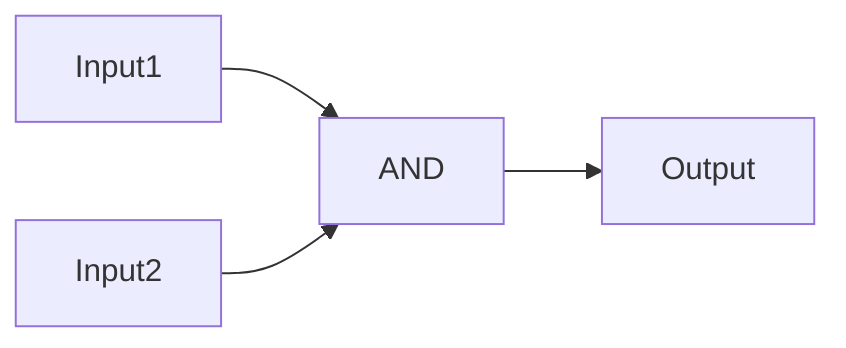
### BOOL SETTER Gate
Sets a BOOL STORAGE to the set bool value.
Input: none
Output: none
- Value: The Bool Value to set a BOOL STORAGE to.

Example Circuit:
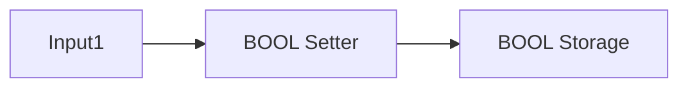

### BOOL STORAGE Gate
Stores a bool value
Input: Bool
Output: Stored Value
- Delay Before Output: Seconds to wait before outputting
- Save Value: ??? (presumambly decides whether value is saved on world restart)
- Value: The stored value

Example Circuit:
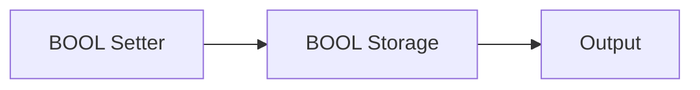

### BOOL SWITCH Gate
Inverts / Switches the value of a BOOL STORAGE Gate
Input: none
Output: none
Example Circuit:
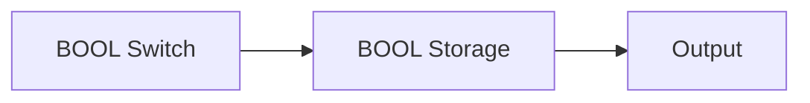

### BREAK VECTOR Block
Gets a specified axis of a [Vector3](https://create.roblox.com/docs/reference/engine/datatypes/Vector3)
Input: Vector3
Output: Number (none if Input is not a vector3)
- Axis: The axis to get from the input.

Example Circuit:
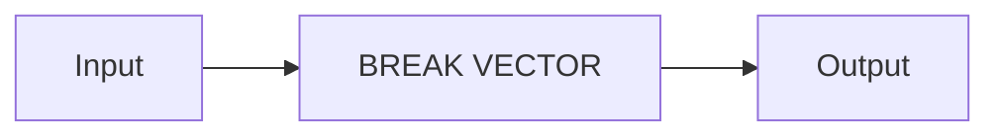
### BUILD VECTOR Block
Combines the X, Y, and Z Properties to form a Vector3.
Input: any (Number if gate uses {INPUT})
Output: Vector3
- X: The X Axis of the Vector3
- Y: The Y Axis of the Vector3
- Z: The Z Axis of the Vector3

Example Circuit:
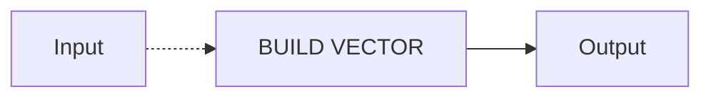
### CHANGE SIGNAL Block
> The Property can be changed in the "Types" Tab in Properties
{.is-info}

Changes the signal into the selected property.
Input: any (Ignored)
Output: any
- Selected Property: The property type to change into.

Example Circuit:
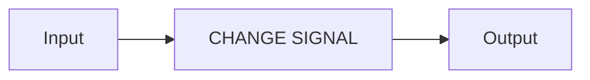
### DELAY Gate
Delays the signal by X seconds. (equivalent of `wait()`)
Input: any
Output: any (same as Input)
- Delay: The amount of time to delay.
- Ignore Deactivation: Determines if the gate will stop its signal when the previous gate stopped sending its signal

Example Circuit:
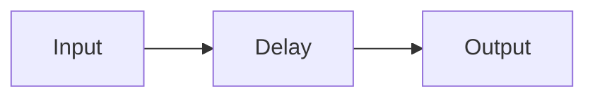
### GET BLOCK PROPERTY
Gets a property of the specified block.
Input: any (Block if Destination is not set)
Output: any (The type of the retrieved property)
- Property Name: The property to retrieve.
- Destination: The block to get the properties from.

Example Circuit:
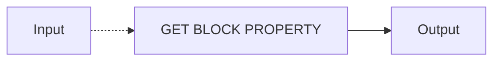
### GET GAME PROPERTY Gate
Gets a property of the world.
Input: any (Type Needed Differs)
Output: any (The type of the retrieved property)
- Property Name: The property to retrieve.
- Value: ??

Depending on the chosen property the Input may need to be a specific type.
- NumPlayersOnTeam: Requires a team name as input.
- IsPlayerOnServer: Requires a username as input.
- TotalColoredBlocks: Requires a color as input.

Example Circuit:
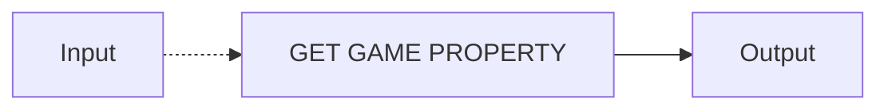
### GET NPC PROPERTY Gate
Gets a property of the specified NPC Block.
Input: any (NPC Block if no Destination is set)
Output: any (The type of the retrieved property)
- Property Name: The property to retrieve.
- Destination: The NPC Block to get the properties from.

Example Circuit:
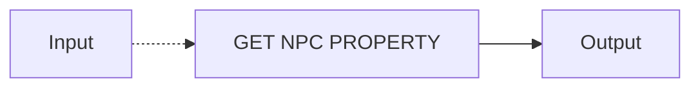
### GET PLAYER PROPERTY Gate
Gets a property of the specified player.
Input: Player Username
Output: any (The type of the retrieved property)
- Property Name: The property to retrieve.

Example Circuit:
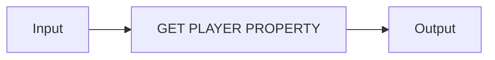
### GET STAT Gate
Gets the stat of the specified player.
Input: Player Username
Output: Number

- Stat Name: The stat to retrieve.

Example Circuit:
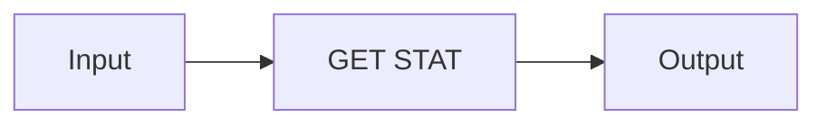
### IF Gate
Checks if the inputted value is the same as Value
Input: any
Output: Bool
- Check Type: How the value is compared.
- Keep Activation: Determines if the gate will stop its signal when the previous gate stopped sending its signal
- Value: The value to compare the Input to.

Example Circuit:
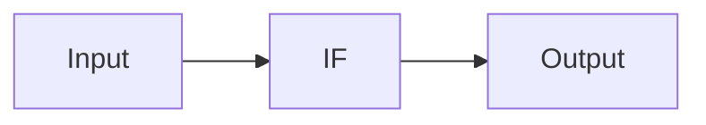

### LOOP THROUGH EVERYONE Gate
When Powered, The gate will loop through every player in the world.
Input: any
Output: Player Username
- Active Time: How long each loop takes. (seconds)
- Delay: How long to wait for another loop. (seconds)
- Loop Type: Determines if it loops through NPCs or Players.

Example Circuit:
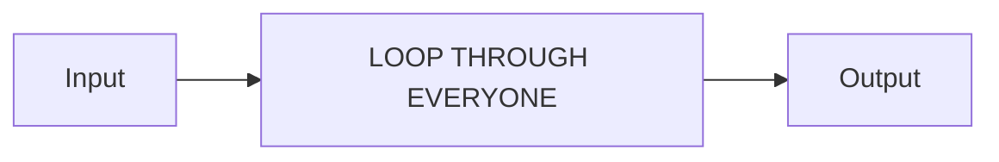
### MATH Gate
Does a math operation on the Input.
Input: Number
Output: Number
- Math Order: Determines if the Input is before the Value and vice versa.
- Operation Type: The operation to do.
- Next Gate Type: Determines if the output needs to go through a NUMBER STORAGE to complete an operation.
- Disable Output: Determines if a connected NUMBER STORAGE outputs its value after this gate output.
- Value: The value to calculate the Input with.

Example Circuit:
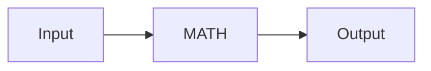
(if Next Gate Type is "Storage")
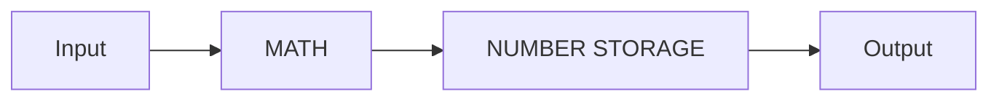
### NOT Gate
Inverts or "Flips" the signal.
Input: any
Output: any (Bool probably??)

Example Circuit:
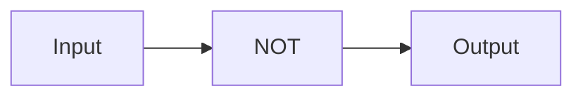
### NUMBER SETTER Gate
> Use `<minimumNumber>`, `<maximumNumber>` as the value to randomly generate a number between `<minimumNumber>` and `<maximumNumber>`.
>
> An example would be creating a Random Number Generator (RNG).
{.is-info}

Sets the value of a NUMBER STORAGE Gate
Input: any (Number if using Input)
Output: none
- Disable Output: Determines if a connected NUMBER STORAGE outputs its value after this gate output.
- Value: The value to store the NUMBER STORAGE.

Example Circuit:
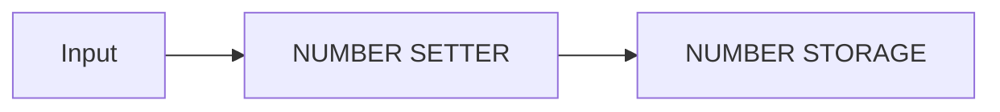
### NUMBER STORAGE Gate
> Stores a number value
{.is-info}

### OR Gate
> The OR gate takes one or multiple input signals and produces an output if at least one input is **true**.
{.is-info}

### REPEATER Gate

If repeat mode is Constant, will repeatedly send a signal after a set amount of seconds for a set amount of time.

If repeat mode is Enumerated, will go from Start to Finish when fired and output the current Index.

If repeat mode is Repetition, will go from Start to Finish when fired and output the input

- Activation time: how long the signal will last until it loops back again.

- Delay: how long to wait before the next loop starts

- Loop type: how the repeater will behave

- Start index: the starting number the repeater will use

- Finish index: the ending number the repeater will use

### SET STAT Gate
> Sets the stat of [STATNAME] to [STATVALUE] for the inputted player
{.is-info}

### TEXT EDITING Gate
> Sets text to a TEXT STORAGE Gate
{.is-info}

### TEXT INPUT Gate
> Waits for user input and outputs what the user typed
{.is-info}

### TEXT STORAGE Gate
> Stores a text value
{.is-info}

### XOR Gate
> The XOR gate takes multiple input signals and produces an output if the number of true inputs are odd.
{.is-info}

# <i class="fa-duotone fa-inbox-out"></i> Output
These wiring blocks carry out functions that usually dont return a output. They power the next gate AFTER they are finished with their function.
> The tabs here are unfinished.
{.is-warning}
## {.tabset}
### Attach Block
### Attribute Changer
### Clone Block
### Command Block
> Runs a command like it was from a normal player.
{.is-info}

Configurations:
- Commands: The command the block will run. Default is `:message all hi!!!`.
### Message Display Block
> Display a message.
{.is-info}

Configurations:
- Affect: A dropdown menu with the options: Everyone, SpecificPlayer.
- Message Color: The color of the message.
- Description: The message description. Only works if the Message Type is set to `Notification`.
- Message Time: The time the message will be shown. Only works if the Message Type is set to `Notification`. Use `0` to calculate the message time. The input is `0` by default.
- Title: The title of the message.
- Message Type: A dropdown menu with the options: Notification, Chat, Console, Shout, Bubble.
- Notification Image ID: The Image ID for the notification. Only works if the Message Type is set to `Notification`.
### Path Block
### Property Changer
### Wiring Variable Block

